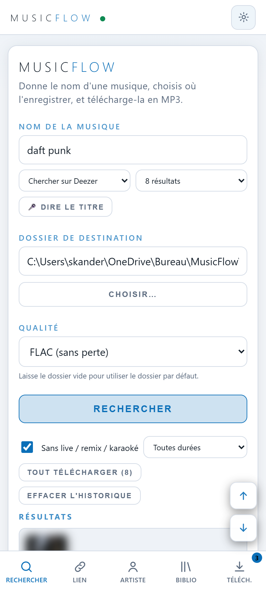

<div align="center">

# MusicFlow

**Télécharge ta musique avec le bon titre, l'artiste, l'album, la pochette et les paroles.**
Android et Windows · gratuit · libre (GPL-3.0) · sans compte ni publicité

[](https://github.com/captentv1/musicflow/releases/latest)
[](LICENSE)


[Site du projet](https://captentv1.github.io/musicflow/) · [Télécharger](https://github.com/captentv1/musicflow/releases/latest) · [Signaler un problème](https://github.com/captentv1/musicflow/issues)

</div>

<p align="center">
  
  
  
  
  
</p>

## Fonctionnalités

**Trouver**
- Recherche par titre (plusieurs sources), par artiste (discographie complète), ou en collant plusieurs titres d'un coup
- Liens de playlists, albums et morceaux : plusieurs liens à la fois, sans doublons
- Découvrir : tops mondiaux, par pays et par genre, playlists populaires
- Recherche vocale, historique, suggestions, filtres (sans live/remix, durée)

**Télécharger**
- File d'attente, plusieurs playlists en parallèle, pause / reprise / arrêt
- Pause automatique sans internet, reprise toute seule au retour de la connexion
- Ne retélécharge jamais ce qui est déjà dans ton dossier ; détection des doublons
- Choix de la meilleure vidéo (durée comparée, versions live/karaoké écartées), comparaison des versions, « autre version » en un clic
- Formats MP3 128/192/320, FLAC, WAV, Opus, AAC ; silences de début et de fin retirés

**Des fichiers propres**
- Titre, artiste, album, genre, n° de piste, année, ISRC, label
- Pochette jusqu'à 1000 px, paroles intégrées + fichier `.lrc` synchronisé
- Bibliothèque : favoris, étiquettes, éditeur de tags, re-taguage des anciens fichiers
- Vérifications : durée suspecte, son saturé ou presque muet

**Confort**
- Thèmes (dont automatique), taille du texte, couleur d'accent, mode compact
- « Partager → MusicFlow » depuis une autre appli (Android)
- Suivi de playlists et d'artistes : nouveaux titres et nouvelles sorties
- Diagnostic intégré, journal d'erreurs, sauvegarde et restauration des réglages

## Installer

**Android (8.0 ou plus récent, 64 bits)**
1. Télécharge [`MusicFlow.apk`](https://github.com/captentv1/musicflow/releases/latest/download/MusicFlow.apk).
2. Ouvre-le et autorise l'installation depuis cette source.

**Windows 10/11**
1. Télécharge [`MusicFlow.exe`](https://github.com/captentv1/musicflow/releases/latest/download/MusicFlow.exe).
2. Double-clique dessus : MusicFlow s'ouvre dans ton navigateur. Rien d'autre à installer.
   (Si Windows affiche « Windows a protégé votre ordinateur » : *Informations complémentaires › Exécuter quand même*.)

**Depuis le code source (Windows)**
```bash
git clone https://github.com/captentv1/musicflow.git
cd musicflow
python -m venv .venv
.venv\Scripts\python -m pip install -r requirements.txt
.venv\Scripts\python app.py        # puis ouvre http://127.0.0.1:5090
```

## Compiler l'APK

Prérequis : JDK 17, SDK Android (plateforme 36), Python 3.13 (requis par Chaquopy pour le build).

```bash
cd android
gradlew assembleDebug             # → app/build/outputs/apk/debug/app-debug.apk
```

Le chemin de Python 3.13 se règle dans `android/app/build.gradle` (`buildPython`).
L'interface est un seul fichier, `index.html`, copié dans `android/app/src/main/assets/` et `android/app/src/main/python/`.

## Comment ça marche

Un petit serveur Python (Flask) fait le travail ; l'interface est une page web, affichée
dans le navigateur sur PC et dans l'application sur Android (via [Chaquopy](https://chaquo.com/chaquopy/)).

| Rôle | Outil |
|---|---|
| Téléchargement audio | [yt-dlp](https://github.com/yt-dlp/yt-dlp) |
| Conversion (Android) | [FFmpegKit](https://github.com/ffmpegkit-maintained/ffmpeg) |
| Tags et pochettes | [mutagen](https://github.com/quodlibet/mutagen) |
| Infos d'album, artistes, tops | API publiques Deezer, iTunes Search, classements Apple Music |
| Paroles | [LRCLIB](https://lrclib.net) |

Aucune clé d'API ni compte n'est nécessaire.

## ⚠️ Avertissement

MusicFlow est un outil destiné à un **usage personnel**. Tu es seul responsable de ce que tu télécharges :
respecte le droit d'auteur et les conditions d'utilisation des services que tu utilises.
Ne télécharge que des contenus que tu as le droit de copier (œuvres libres de droits, sous licence
Creative Commons, ou dont tu possèdes les droits). Ce projet n'est affilié à aucun service de musique
ou de vidéo ; les noms cités le sont à titre descriptif.

## Licence

[GPL-3.0](LICENSE) — tu peux utiliser, étudier, modifier et redistribuer MusicFlow, à condition de
garder la même licence et de publier tes modifications.
