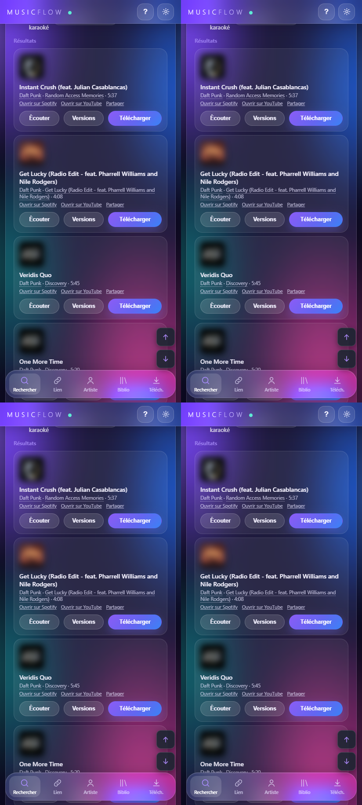
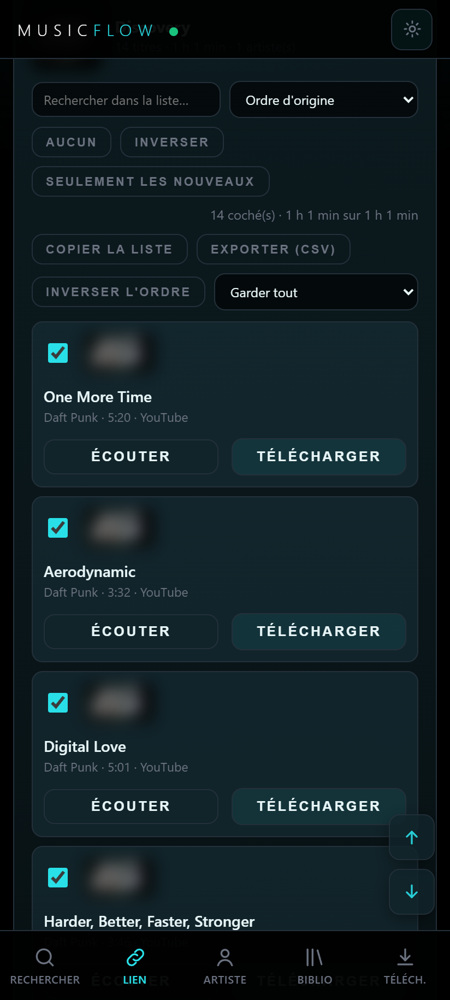
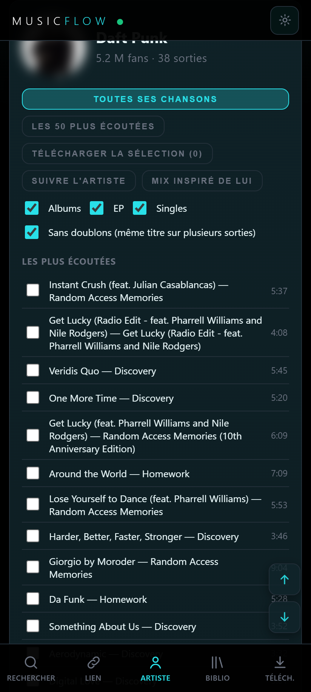
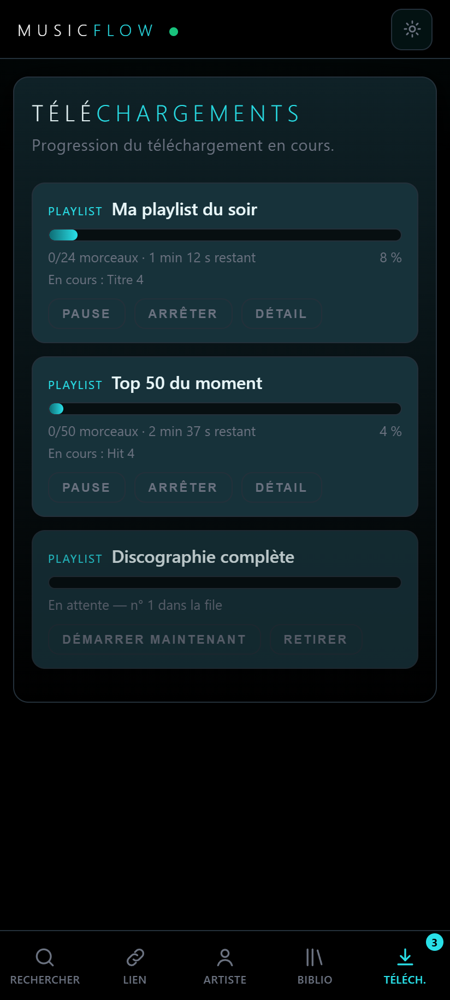
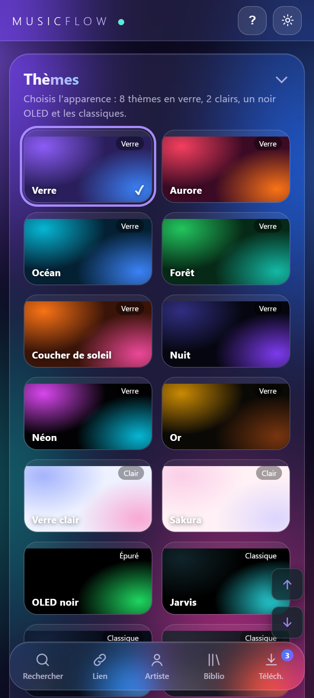

<div align="center">

# MusicFlow

**Download your music with the right title, artist, album, cover art and lyrics.**
Android and Windows · free · open source (GPL-3.0) · no account, no ads

[](https://github.com/captentv1/musicflow/releases/latest)
[](LICENSE)


[Website](https://captentv1.github.io/musicflow/) · [Download](https://github.com/captentv1/musicflow/releases/latest) · [Report a bug](https://github.com/captentv1/musicflow/issues)

</div>

<p align="center">
  
  
  
  
  
</p>

## Features

**Find**
- Search by title (several sources), by artist (full discography), or paste many titles at once
- Playlist, album and track links: several links at a time, without duplicates
- Discover: global, per-country and per-genre charts, popular playlists
- Voice search, history, suggestions, filters (no live/remix, duration)

**Download**
- Download queue, several playlists in parallel, pause / resume / stop
- Keeps downloading in the background; pauses without internet and resumes on its own
- Never re-downloads what is already in your folder; duplicate detection
- Picks the best video (duration check, live/karaoke versions skipped), compare versions, “other version” in one tap
- MP3 128/192/320, FLAC, WAV, Opus, AAC; leading and trailing silence removed

**Clean files**
- Title, artist, album, genre, track number, year, ISRC, label
- Cover art up to 1000 px, embedded lyrics + synced `.lrc` file
- Library: favorites, tags, tag editor, re-tagging of older files, shrink big files
- Checks: suspicious duration, clipped or nearly silent audio

**Comfort**
- 16 themes (glass style, light, OLED black, automatic), text size, accent color, compact mode
- Interactive tutorial on every screen
- “Share → MusicFlow” from another app (Android)
- Follow playlists and artists: new tracks and new releases detected
- Built-in diagnostics, error log, settings backup and restore

## Install

**Android (8.0 or newer, 64-bit)**
1. Download [`MusicFlow.apk`](https://github.com/captentv1/musicflow/releases/latest/download/MusicFlow.apk).
2. Open it and allow installing from this source.

**Windows 10/11**
1. Download [`MusicFlow.exe`](https://github.com/captentv1/musicflow/releases/latest/download/MusicFlow.exe).
2. Double-click it: MusicFlow opens in your browser. Nothing else to install.
   (If Windows shows “Windows protected your PC”: *More info › Run anyway*.)

**From source (Windows)**
```bash
git clone https://github.com/captentv1/musicflow.git
cd musicflow
python -m venv .venv
.venv\Scripts\python -m pip install -r requirements.txt
.venv\Scripts\python app.py        # then open http://127.0.0.1:5090
```

## Build the APK

Requirements: JDK 17, Android SDK (platform 36), Python 3.13 (required by Chaquopy for the build).

```bash
cd android
gradlew assembleRelease           # → app/build/outputs/apk/release/app-release.apk
```

The Python 3.13 path is set in `android/app/build.gradle` (`buildPython`).
Release signing reads a keystore kept outside the repository; without it, use `gradlew assembleDebug`.
The whole interface is a single file, `index.html`, copied to `android/app/src/main/assets/` and `android/app/src/main/python/`.

## How it works

A small Python server (Flask) does the work; the interface is a web page, shown in the
browser on PC and inside the app on Android (via [Chaquopy](https://chaquo.com/chaquopy/)).

| Role | Tool |
|---|---|
| Audio download | [yt-dlp](https://github.com/yt-dlp/yt-dlp) |
| Conversion (Android) | [FFmpegKit](https://github.com/ffmpegkit-maintained/ffmpeg) |
| Tags and covers | [mutagen](https://github.com/quodlibet/mutagen) |
| Album info, artists, charts | Public Deezer API, iTunes Search, Apple Music charts |
| Lyrics | [LRCLIB](https://lrclib.net) |

No API key or account is needed.

## ⚠️ Disclaimer

MusicFlow is a tool for **personal use**. You alone are responsible for what you download:
respect copyright and the terms of service of the services you use.
Only download content you are allowed to copy (public domain, Creative Commons, or content
you own the rights to). This project is not affiliated with any music or video service;
names are mentioned for descriptive purposes only.

## License

[GPL-3.0](LICENSE) — you may use, study, modify and redistribute MusicFlow, provided you keep
the same license and publish your changes.
